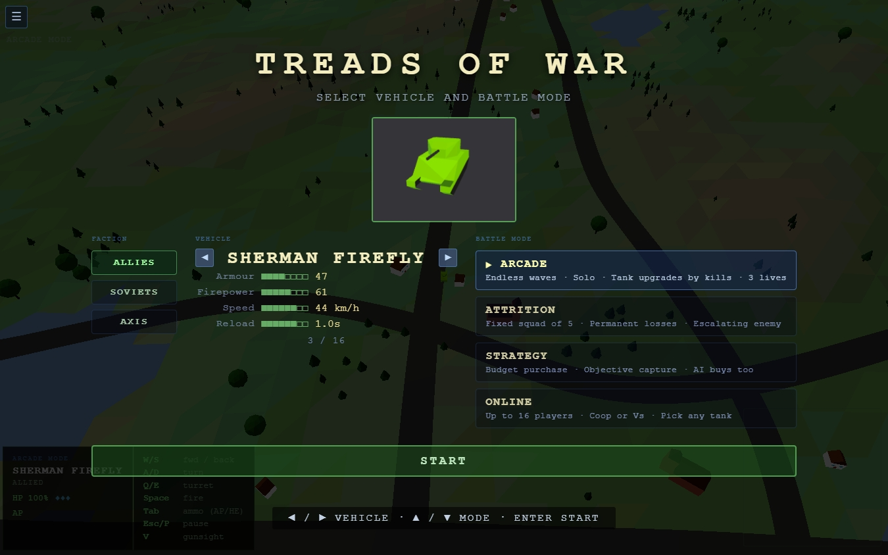

# Treads of War

[Treads of War](https://treads.togneri.net) is a browser-based 3D tank combat game built with Three.js. Inspired by [Conqueror](https://en.wikipedia.org/wiki/Conqueror_(video_game)) by Superior Software (Acorn Archimedes, 1988). Flat-shaded polygon aesthetic, WWII European theatre, procedurally generated terrain. Four game modes, 16 tanks across 4 factions, online play for up to 16 players.

**Runs entirely in your browser - no download required.** Play it right now for free at [https://treads.togneri.net/](https://treads.togneri.net/).



---

## Inspiration

Conqueror (1988) by Superior Software was one of the definitive tank combat games for the Acorn Archimedes - flat-shaded rolling hills, a roster of WWII vehicles with genuine stat differences, and satisfying armour-penetrating physics (see a video [here](https://www.youtube.com/watch?v=R2IEfkj117U)). Treads of War is a browser reimplementation of that experience, built from scratch with Three.js.

---

## Project history and AI disclosure

This has been a long-runing passion project that I was just working on locally. Recently, I was able to utilise Claude to help with improvements and feature development. This sped things up VASTLY, really as a hobbyist I was shocked how much progress I made. That's why I decdided to put in on Github (old habits from my childhood are just to develop locally for my own sake, because typically I make things just for me, not to share).

I'm sure everybody is sick of vibe-coded slop, and I'm sure by now large chunks of the codebase fit this category. Is that important? This is a game. It doesn't require or store any sensitive information. If Claude can help me get it out faster and with more and better features, then that's fine by me. I'm learning a lot and having fun, and that's really my aim here. If you don't like AI assistance in projects, feel free to move along. 

---

## Game modes

* **Arcade**: Solo survival. Survive endless waves of enemy armour. Every 4 kills upgrades your tank class (light to medium to medium-heavy to heavy). Three lives. Waves grow larger at the heavy class tier.
* **Attrition**: Fixed squad of 5 allied tanks, permanent losses. Enemy squads escalate each battle through 4 tiers. Freely switch between surviving tanks. Smoke grenades and HE ammo available.
* **Strategy**: Budget purchase screen before each battle. Buy any mix of tanks from your faction within the budget. Win by holding the objective ring for 60 continuous seconds. Use whatever edge you have: smoke, artillery barrage, spotter plane. Supply crates spawn on the map.
* **Online**: Up to 16 players over LAN or the internet via WebSocket relay. Host runs authoritative simulation at 60 fps, broadcasts at 20 Hz, and handles any AI allies or opponents. Client-side prediction with server correction. 4 team colours, room codes, ping display, Vs or CTF gameplay mode.

---

## BETA / WIP / Wishlist

* Mobile-native browser play is still in beta. Mostly works but needs some attention.
* Churches don't have any windows or doors!
* Weather effects are still a little glitchy sometimes
* Sounds need an overhaul
* Known bugs with graphical clipping, especially with roads and eg. impact craters
* Weapon crates in Attrition mode need reviewed
* Abilities in Attrition mode need reviewed

---

## Treaducation - code and learn

Want to learn how to build a game? Look no further! [Treaducation](https://treads.togneri.net/treaducation/) is a resource to help inquisitive teens take their first steps in Three.js and hopefully into the joy of creation. This is an ultra-minimalist walkthrough of how to build an interactive 3D tank battle, aimed at beginners and the curious. Want to know more? Give it a try for yourself!

* Self-documenting starter files for students (available as a zip download)
* Everything offline: local Three.js bundled, no internet needed, no other dependencies
* README.md for student quick start
* Full teacher's guide which assumes no coding knowledge

---

## Tech stack

- **Renderer**: Three.js (WebGL), no build step, vanilla ES modules
- **Audio**: Web Audio API (no audio files - all synthesised)
- **Networking**: WebSocket relay (Node.js) for Online mode
- **Deployment**: nginx static serving + Docker Compose

---

## Running locally

Any static file server works:

```bash
./serve.sh          # Python 3, serves on http://localhost:8080
# or
docker compose up   # nginx on port 53312
```

Online mode requires the relay server:

```bash
cd relay && npm install && node relay-server.js
# Listens on port 8765 - players must be able to reach it on your LAN
```

---

## Server setup (Docker + nginx)

### Docker Compose

```yaml
services:
  treads:
    image: nginx:alpine
    ports:
      - "53312:80"
    volumes:
      - ./src:/usr/share/nginx/html:ro
    restart: unless-stopped

  relay:
    build: ./relay
    ports:
      - "8765:8765"
    restart: unless-stopped
```

### Reverse proxy

The relay requires proxy rules for `/relay` (WebSocket) and `/relay/discover` (HTTP). Example configs are included for the three most common setups:

- [nginx-sample.conf](nginx-sample.conf) - for Nginx Proxy Manager or self-managed nginx
- [traefik-sample.yml](traefik-sample.yml) - Docker labels for Traefik v2/v3
- [caddy-sample.Caddyfile](caddy-sample.Caddyfile) - for Caddy

The game auto-switches between `ws://` (HTTP) and `wss://` (HTTPS) depending on how it is served.

### Deploy script

```bash
./deploy.sh
```

On first run, the script will prompt for your server details:

- SSH user and host (e.g. `user@192.0.2.10`)
- Remote web root path
- Remote relay directory
- Remote Docker Compose directory
- Relay service name
- Domain name

These are saved to `.deploy.conf` (gitignored) and reused on subsequent runs. The script rsyncs `src/` and `relay/` to the server, then SSHs in to rebuild and restart the relay container.

---

## Analytics

This site collects anonymous usage statistics: page views, device type, coarse location (country/region derived from IP), and in-game events such as mode selection and session duration. No cookies are used. All data is processed and stored on togneri.net's own servers and is never shared with or sent to any third party. The analytics platform is self-hosted [Umami](https://umami.is).

---

## Legal note

Fan project. Unofficial and non-commercial. No original assets from Conqueror (1988) are included.
